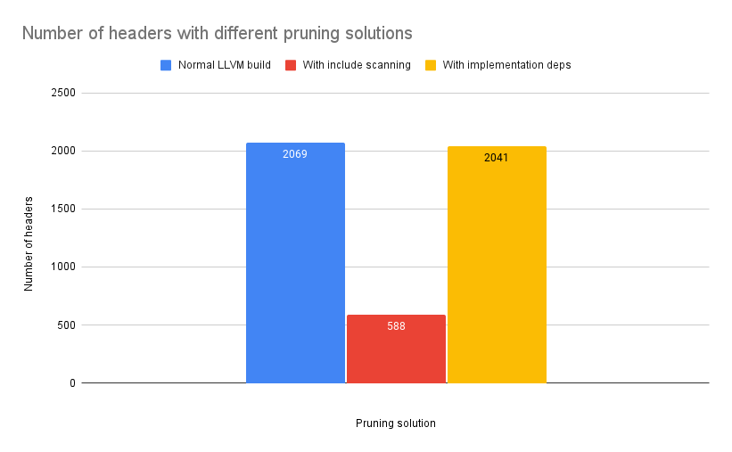

# Include Scanning v Implementation Dependency performance

## Description

This is an exploration into the performance trade-offs of the
[enabling include scanning patch to bazel][patch].

It was suggested that this should instead be done by optimizing the
use of implementation deps, and automating writing a correct build
graph instead of using include scanning at execution time.

These approaches are similar, however implementation deps will result
in a coarser-grained distribution of the dependencies, since its
header exclusion cuts off at the library level, rather than the
individual file level.

This repository calculates what the difference in header counts would
be for a project, by comparing the pre- and post-include scanning
graphs of a project, and then assuming that any library target whose
headers are not used by any dependency can be turned into an
implementation dep, and would therefore not export its headers.

We have found a significantly larger reduction in header files from
include scanning compared to implementation deps on the llvm project.

## Results

These are using `bazel aquery` dumps of the llvm project - they are
stored in [raw-aqueries/llvm](raw-aqueries/llvm). These graphs are a
bit tricky to create, since bazel also normally performs `.d` pruning,
which must be turned off, and since include scanning happens at the
execution phase these graphs must be captured *after* an initial
build.

We then use the scripts in
[utils/aquery_header_graph.py](utils/aquery_header_graph.py) and
[utils/emulate-implementation-deps-optimization.py](utils/emulate-implementation-deps-optimization.py)
to calculate the header counts.

We ultimately arrived at these results:

## Limitations

- We have only investigated this on the llvm project. Other project
  graphs will of course be different, perhaps to an extent that
  implementation deps and include scanning will perform similarly.
- There is of course an overhead incurred by include scanning at
  execution time. This would not be present with implementation deps,
  and these tests do not account for this.
- There are some as-of-yet unexplained *additions* to the include
  scanning graph over the non-include scanning graph. This amounts to
  roughly 1% of header files in this case.

[patch]: https://github.com/bazelbuild/bazel/pull/13871
